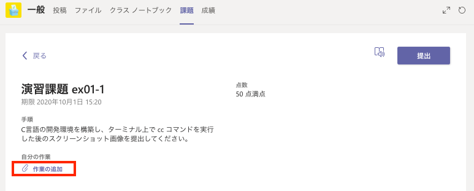

# ex01 — イントロ、C プログラミング環境の構築、シェルコマンドの操作

| 実習回 | 日付 | 講義資料 | 印刷用資料 |
|:--:|:--:|---|---|
| 1 | 2026/09/24 | [prog2-00.pdf（ガイダンス）](slides/prog2-00.pdf), [prog2-01.pdf](slides/prog2-01.pdf) | [prog2-01-mono.pdf](slides/prog2-01-mono.pdf) |

## 第 01 回の演習課題

### 演習課題 ex01-1

講義パートでも説明した（はず）ように、ここでは各 OS の標準的な C 言語プログラミング環境を各自で構築します。

前期の「プログラミング及び実習1（中野）」では、初学者の理解を促すため、タートルグラフィックスを利用した
数理課程の独自環境で C 言語プログラミングを体験しました。この科目では 2 年次以降の科目でも利用する
各 OS 標準の方法で、より一般的な C 言語プログラミング環境を各自の PC 上に構築します。
以下を参考にしながら、各自で C 言語開発環境を構築してください。

=== "Windows"

    - [Windows への WSL の導入と日本語化](setup/wsl-install.md)
    - [Ubuntu Linux の C 言語開発環境](setup/ubuntu-c.md)

=== "macOS"

    - [macOS の C 言語開発環境](setup/macos-c.md)

C 言語環境の構築ができたら、**`cc` コマンドを実行したターミナルウィンドウのスクリーンショット画像**を撮影し、
Teams の科目チーム **課題 ex01-1** として提出してください。

- 各 OS でのスクリーンショット画像の撮影方法は [PC 画面のスクリーンショットを撮る](setup/screenshot.md) にあります。
- Teams の「課題」でファイルを提出する場合は、**「作業の追加」** から提出ファイルを選択します。
  「作業の追加」選択後、自分の PC 上のファイルを追加する場合は、左下の「このデバイスからアップロード」を選択してください。

{ width="600" }

### 演習課題 ex01-1'（必須では無いが推奨）

より快適なプログラミング開発環境を構築するために、以下のような設定を行うことをお勧めします。

- Visual Studio Code（エディタ）のインストール（中野）: [Windows](http://www602.math.ryukoku.ac.jp/Prog1/vscode-win.html) / [macOS](http://www602.math.ryukoku.ac.jp/Prog1/vscode-mac.html)
- [WSL のための Visual Studio Code 設定](setup/vscode-wsl.md)
- [WSL と Windows とのファイル共有](setup/wsl-file-sharing.md)

### 演習課題 ex01-2

講義パートでも説明したように、この科目ではターミナル（端末）と呼ばれるコマンドベースのインターフェイス（CUI）を用いて、
ファイルの操作や C プログラムのコンパイル・実行などを行います。CUI の操作については、実際に自分で利用しながら
少しずつ慣れていってください。

- 参考: [Unix/Linux コマンドリファレンス（日本語チートシート, PDF）](https://kanemotilevel.com/wp/gazou/unix.pdf)

ここでは、課題学習としてオンラインのプログラミング学習コンテンツ [paiza ラーニング](https://paiza.jp/works/) を利用します。

#### paiza ラーニングの利用準備

まずは [paiza ラーニングでクーポンコードを使う](setup/paiza-coupon.md) を参考に、
paiza ラーニングへのユーザー登録とクーポン登録を行ってください。

#### シェルコマンド入門編の「認定証」を取得する

- paiza ラーニングの [**「シェルコマンド入門編 1（全 9 回）」**](https://paiza.jp/works/shellcommand/primer) に取り組んでください。
  paiza ラーニングの講座は、トップページ上部の「講座一覧」から探すことができます。
- 「シェルコマンド入門編 1」のすべてのチャプターを受講し各演習に合格すると、以下のような「認定証」が表示されます。
  認定証が表示されたら、**ユーザー名も含めた認定証全体のスナップショット画像**を撮影してください。

{ width="600" }

- **Teams の科目チーム 課題 ex01-2 として、認定証のスナップショット画像を提出してください。**

#### その他、すべての有料講座が利用可能です

登録したクーポンコードで paiza ラーニングの（有料講座を含む）すべての講座が利用可能です（C 言語講座もあります！）。
興味ある内容があれば、積極的に取り組んでみてください。

書籍やオンラインコンテンツなどを利用して自学できる能力は、どのような分野を学ぶときにも必要ですが、
とくに日々技術が更新される情報分野では必須です。

paiza ラーニングの学校クーポンコードは年度末まで有効です。来年度も更新取得可能です。

### 演習課題 ex01-3（必須ではありません）

paiza ラーニングの [**「Linux 入門編（全 5 レッスン）」**](https://paiza.jp/works/linux/primer) に取り組んでください。

**Teams の科目チーム 課題 ex01-3 として、修了した Linux 入門の各レッスン認定証のスナップショット画像を提出してください。**
複数のレッスンを修了した場合は、それぞれの認定証の画像を提出してください。
