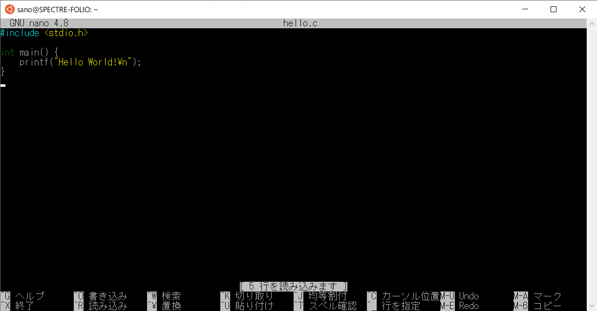
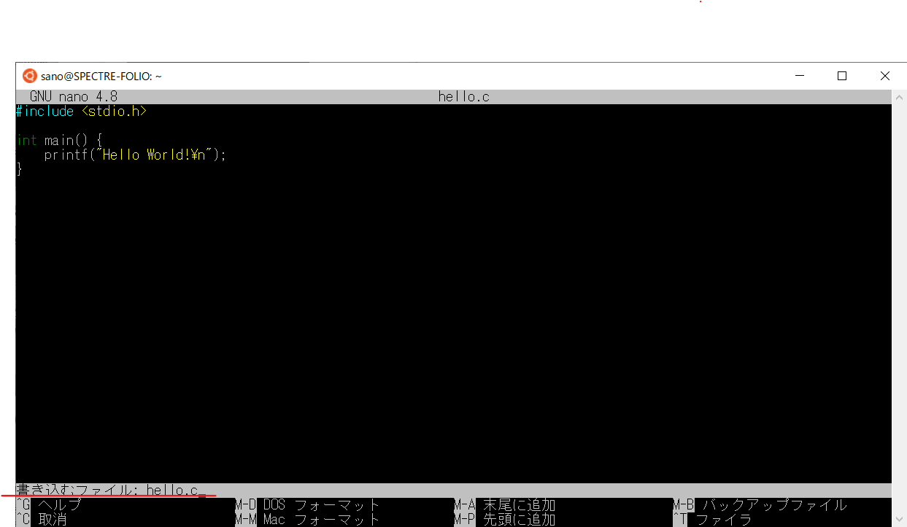
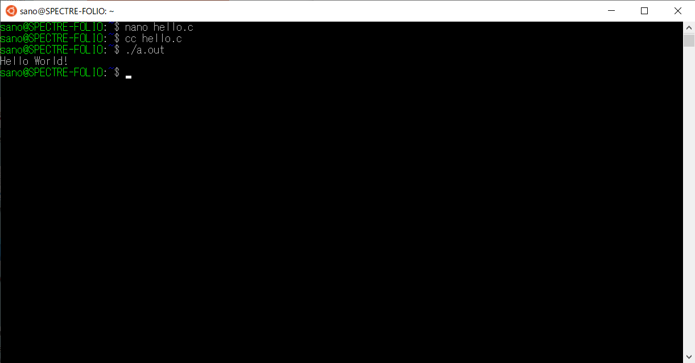

# 簡単なC言語のプログラミングソースをコンパイル・実行してみる

**nano** というテキストエディタで、試しに簡単にCコードを書いてコンパイルしてみましょう。ただし、実際の演習では、Visual Studio Code などのより高機能なエディタを使うことをお勧めします。

編集したい適当なC言語のソースファイル名を指定して（ここでは hello.c） nano を実行します。

```sh
nano hello.c
```

nano が起動したら、以下の様なCのソースコードを入力してみましょう。画面に「Hello World!」を出力するC言語プログラムです。



Ctr-O（コントロールキー + O）でファイルに書き込みます。ファイル名を確認してエンターキーを入力します。 Ctr-X で nano を終了します。



*cc* コマンド（Cコンパイラ）で、ソースファイル hello.c から実行ファイルを作成します。

```sh
cc hello.c
```

*cc* コマンドは、何も指定をしないと a.out という名前の実行ファイルを作成します。a.out を実行（./ が必要）してみましょう。

```sh
./a.out
```

a.out が実行され、Hello World! が出力されました。


