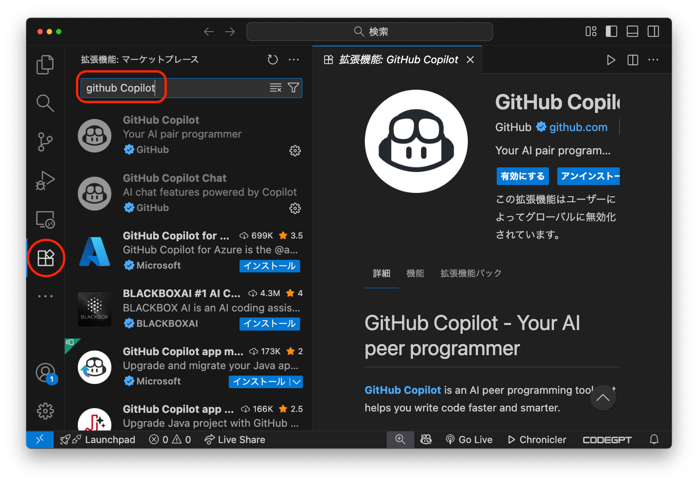
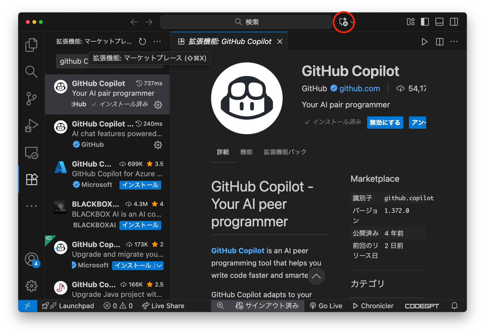
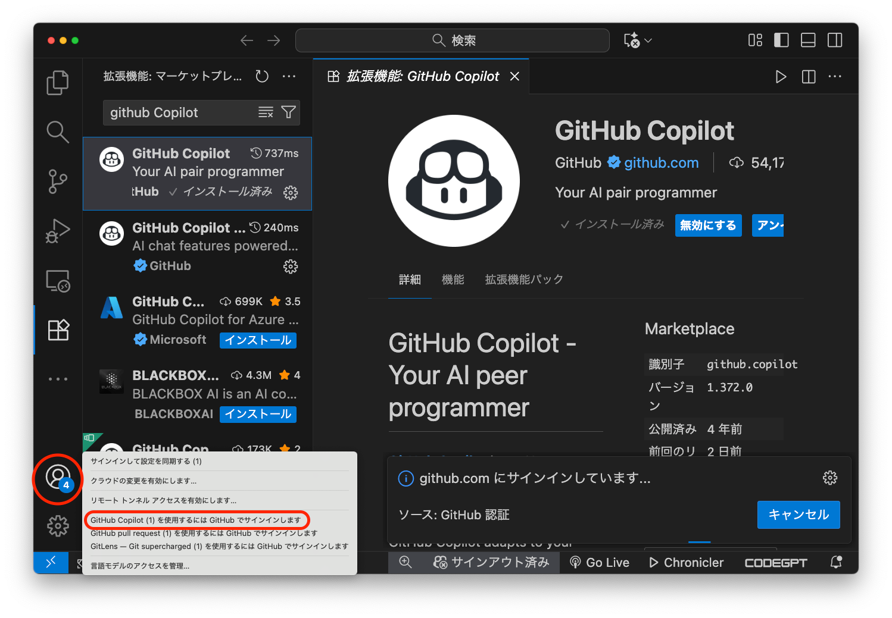
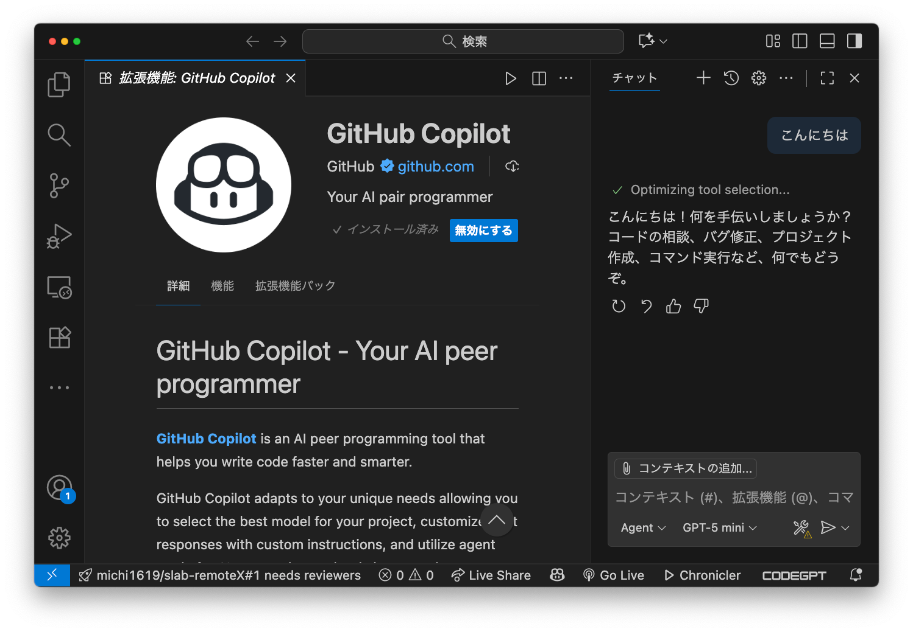
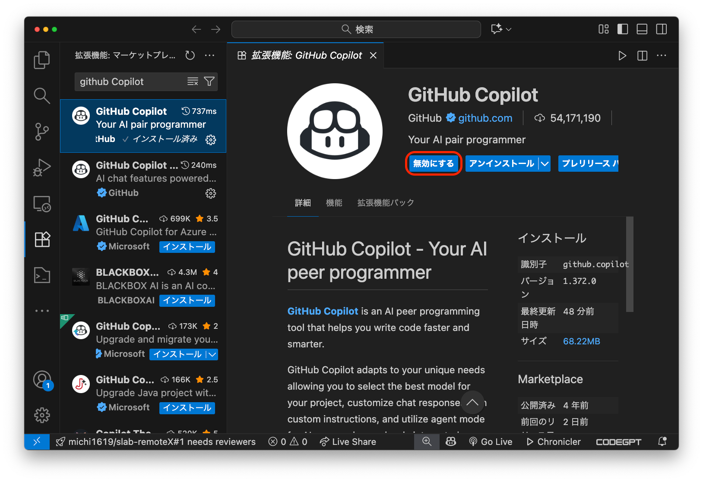
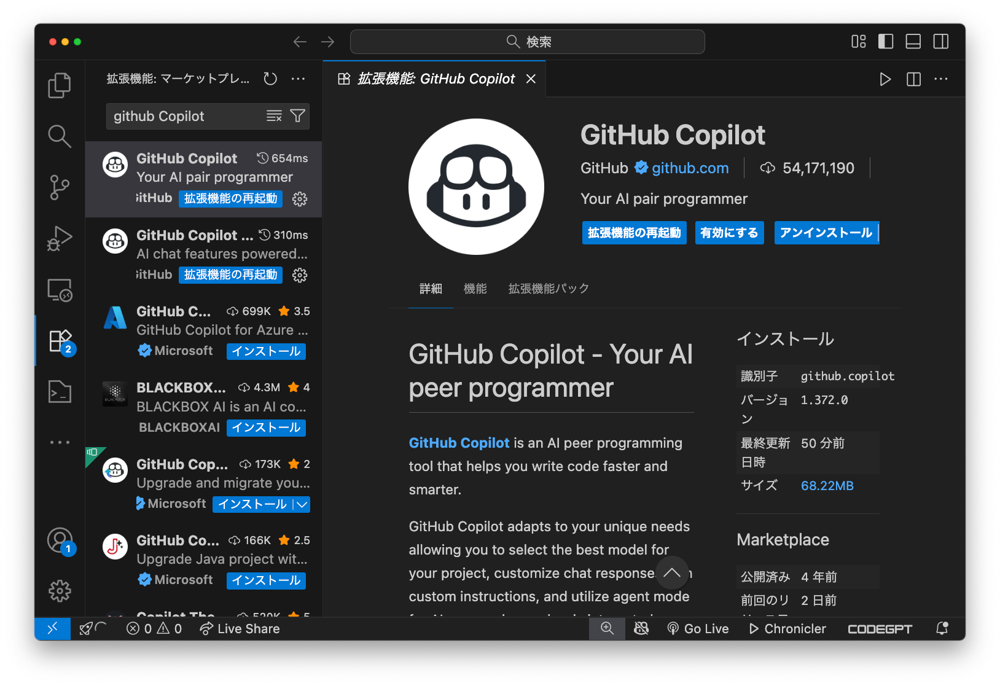
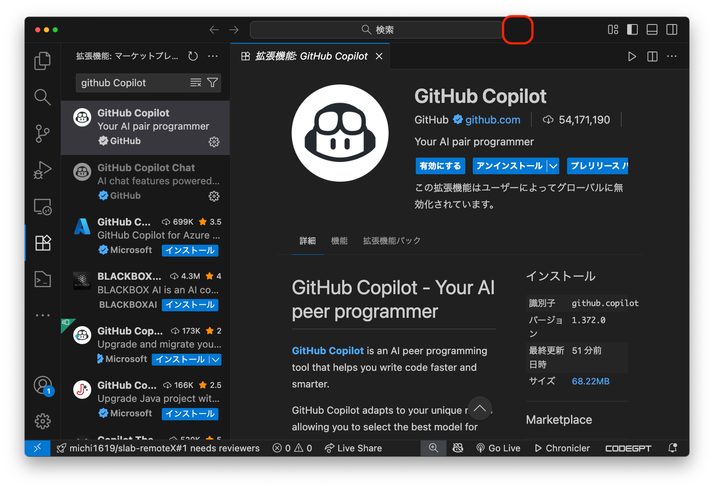

# GitHub Copilot の有効化・無効化

GitHub Copilot は VS Code 上で利用できるコーディングAIです。プログラミングやデバックにとても役立ちますので、積極的に利用してください。一方で、優秀すぎるため演習問題やエラーメッセージを丸投げしても解答・解決してくれるため、使い方によってはユーザーが脳死状態（何も考えなくなる）となります。

この科目では、演習やデバック作業などでコーディングAIを利用することを推奨していますが、一方で**プログラミング試験（小テスト）ではコーディングAIの利用を禁止**しています。自分自身の学修をコントロールしながらコーディングAIなどの生成AIサービスを活用してください。

ここでは、GitHub Copilot を利用するための情報をまとめています。

## **GitHub Copilot for Education への登録**

学生は GitHub Copilot の Pro版 を無料で利用できます。

- [Students - GitHub Education](https://github.com/education/students?locale=ja)

登録時には学生証の撮影などが必要です。また、位置情報も確認されるので大学キャンパスで登録作業をするとスムースです。

登録のための具体的なドキュメントや解説記事は、たとえば以下にあります。

- [学生、教師、またはメンテナとして GitHub Copilot Pro に無料でアクセスする - GitHub Docs](https://docs.github.com/ja/copilot/how-tos/manage-your-account/get-free-access-to-copilot-pro)

- [学生無料のCopilot を使うために GitHub education に登録 - Qiita](https://qiita.com/melonsode/items/3602ea6441ca82e43c5a)

- [2025年版 GitHub Education 申請手順・CraftStadium](https://www.craftstadium.com/blog/github-education-applicant)

## VS Code での GitHub Copilot の有効化

1. VS Code を立ち上げて、左側のメニューから「拡張機能」を選択してください。
2. 拡張機能の検索窓から「github copilot」を検索します。
    

3. 表示された GitHub Copilot をインストールします。「GitHub Copilot」と「GitHub Copilot Chat」があります。一方を選択すると両方がインストールされます。
4. GitHub Copilot が有効化されると、VS Code 上部の検索窓の右側に Copilot のアイコンが表示されます。
    

5. Copilot のアイコンに x 印がついている場合は、GitHub へのサインインが必要です。左下のユーザーアイコンから GitHub へログインしてください。
    

6. 設定が完了していれば、Copilot アイコンのクリックで Copilot の画面が表示されチャットができるようになります。
    

## VS Code での GitHub Copilot の無効化

プログラミング試験（小テスト）などで、GitHub Copilot を一時的に無効化する方法です。

1. 左メニューの拡張機能アイコンから、インストール済みの Github Copilot 拡張機能を選択します。
2. 表示された GitHub Copilot 拡張機能から「無効にする」を選択。
    

3. さらに「拡張機能の再起動」をすると、
    

4. GitHub Copilot が無効化されます。検索窓横の Copilot アイコンが表示されていないことを確認して下さい。
    

5. 有効化する場合は、その拡張機能画面から「有効化する」>「拡張機能の再起動」で再び有効化されます。
