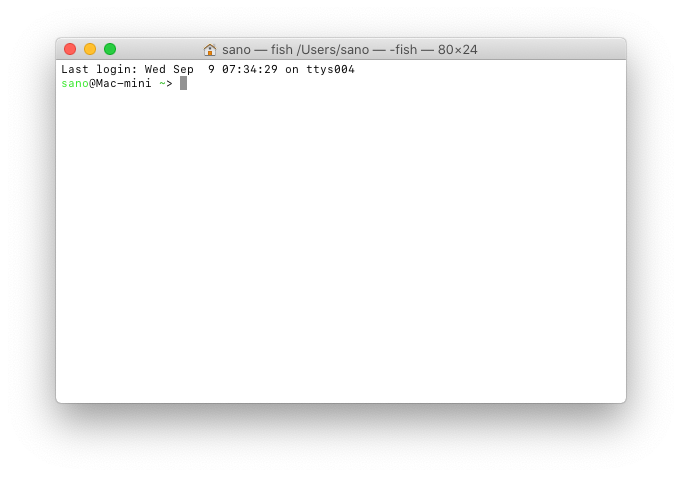
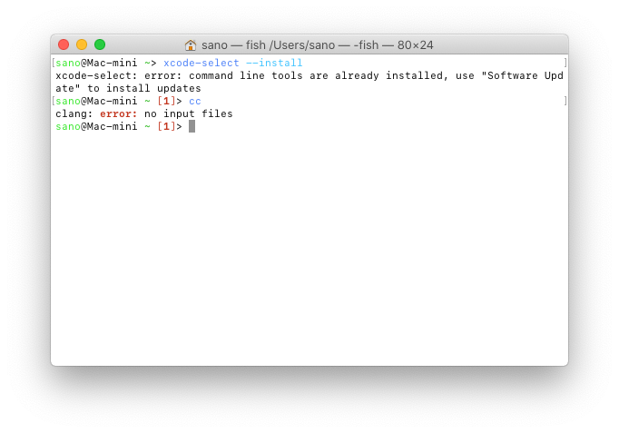

# macOS のC言語開発環境

macOS は Unix系の流れを汲んでいるため、大きな手間なく Linuxライクな開発環境を準備することができます。

### 1. ターミナルの起動

macOS 標準のコマンドラインベースのインターフェイスである **ターミナル.app** を起動します。



### 2. 開発環境のインストール

起動したターミナル上で以下のコマンドを入力すると、自動的に開発環境のダウンロードとインストールが始まります。

```sh
xcode-select --install
```

すでにインストール済みの場合は、以下のようなエラーが出ますが気にしない。



ターミナル上で*cc*コマンド（C言語コンパイラです）を入力し、

```sh
cc
```

以下のように「エラー：入力ファイルがありません」と言われたら準備完了です。

```sh
clang: error: no input files
```

### （おまけ）簡単な C 言語のプログラムをコンパイル・実行してみる

環境ができたら [簡単な C プログラムをコンパイル・実行してみる](c-hello.md) を試してください。
