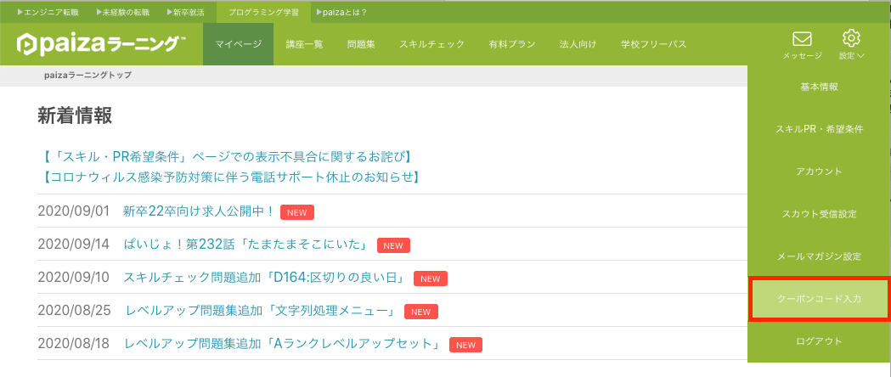

# paizaラーニングでクーポンコードを使う

[paizaラーニング](https://paiza.jp/works/)（ぱいざ・らーにんぐ）は、初心者〜中級者向けのプログラミング学習さいとです。面倒な環境構築が不要で、PCとインターネット環境さえあればすぐに学習が始められます。

教育機関向けに発行される「学校フリーパス」のクーポンコードを利用することで、最長１年間（当該年度末まで）すべての講座を無料で受講することができます。

現在は先端理工学部の数理・情報科学課程、数理情報学専攻に所属する学生・教員が利用可能です。以下を参考にユーザー登録とクーポンの取得・登録を行ってください。

#### **Step1 クーポンコードの取得**

- [paizaラーニング](https://paiza.jp/works/)のすべての有料コンテンツを利用可能な、教育機関向けのクーポンコードを取得します。
- [paizaラーニング 学校フリーパスのクーポンコード申請フォーム](https://forms.office.com/Pages/ResponsePage.aspx?id=31-2I-OkGUqwPRKx1XrXbmv6frjvZVRBqaJDg6gjzOFUNU84QklEWk5US1ZPM0ZOVUFFSkNZNThJTi4u)に回答して、クーポンコードを取得して下さい。

#### **Step2 paizaラーニングのユーザー登録**

- [paiza.jp](https://paiza.jp/) にアクセスし、**paizaラーニング**から「新規登録」を選択（すでにアカウントを持っている場合はログイン）し、ユーザー登録を行って下さい。

#### **Step3 クーポンコードの登録**

- paizaラーニングへのログイン後、画面右上の**設定**から「クーポンコード入力」を選択し、取得したクーポンコードを入力します。
- また、授業科目で利用する場合は「アカウント」から学籍番号を含んだニックネームを必ず設定して下さい。講座修了時の認定証のユーザー名表示に必要となります。
    

### Paizaラーニング学習スタートマニュアル（公式）

- [paizasupport.zendesk.com](https://paizasupport.zendesk.com/hc/ja/article_attachments/46795160646553)
