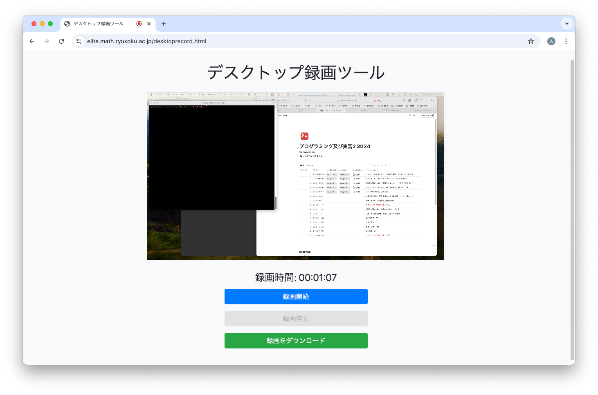

# PC のデスクトップ録画

!!! note "今年度のプログラミング試験は教室で実施します"
    デスクトップ録画は、やむを得ない事情でオンライン受験が認められた場合にのみ必要です。
    通常は準備不要です。

プログラミング試験用のデスクトップ録画環境を準備します。

試験に利用する PC の Web ブラウザからデスクトップ画面を記録することで、オンライン試験中の不正行為を防止し、
公正に受験していることの証明とします。

オンライン試験では、デスクトップ録画の録画データを提出することで受験したと認められます。
オンラインでの受験を行う場合は、以下を参考にしてデスクトップ画面をきちんと録画できることを確認し、
また、録画データを提出できるように準備してください。

## デスクトップ録画ツール { #desktop-record-tool }

- [デスクトップ録画ツール](https://elite.math.ryukoku.ac.jp/desktoprecord.html)

録画開始ボタンを押すと録画画面の選択ページが表示されます。プログラムを作成するデスクトップ画面全体を選択すると
録画が開始されます。録画停止ボタンを押すと録画が停止され、録画されたファイルをダウンロードできます。
再度、録画開始ボタンを押すと新しいデスクトップ録画が開始されます。

- PC のローカル環境に録画データが保存され、保存した録画ファイルを提出します。
- PC 上で比較的多くのメモリとディスク容量（約 10MB/分、1GB/時間）を必要とします。
  2 時間の録画では 2GB を超えるファイルサイズとなることがあります。PC のディスク容量を事前に確認しておいてください。
- 録画時間に制限はありません。2 時間を 1 つの録画ファイルとして提出できます。

比較的新しい PC で、8GB 以上のメモリを搭載しており、ディスク容量に数十 GB 以上の空きがあれば問題なく利用できます。
