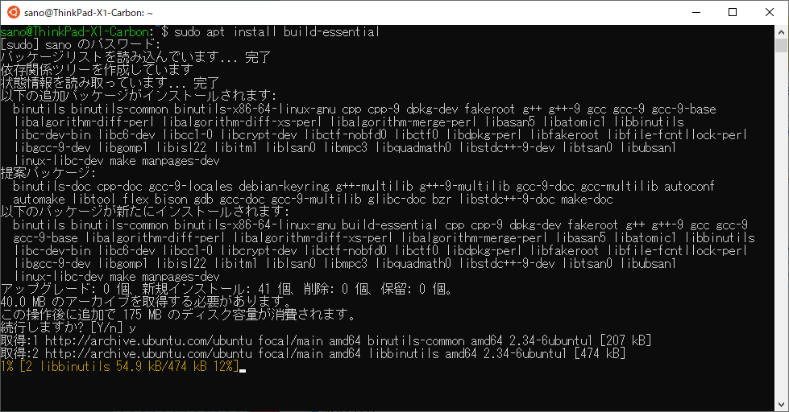
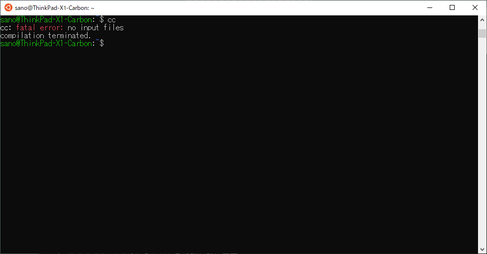

# Ubuntu Linux の C 言語開発環境

### build-essential パッケージをインストール

*apt install* コマンドで、build-essential パッケージをインストールします。

```sh
sudo apt install build-essential
```



ターミナル上で*cc*コマンド（C言語コンパイラです）を入力し、

```sh
cc
```

以下のように「エラー：入力ファイルがありません」と言われたら準備完了です。



### （おまけ）簡単な C 言語のプログラムをコンパイル・実行してみる

環境ができたら [簡単な C プログラムをコンパイル・実行してみる](c-hello.md) を試してください。
