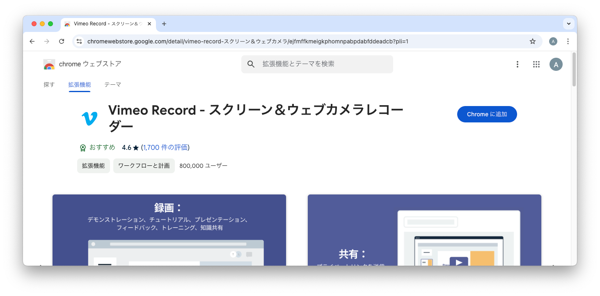
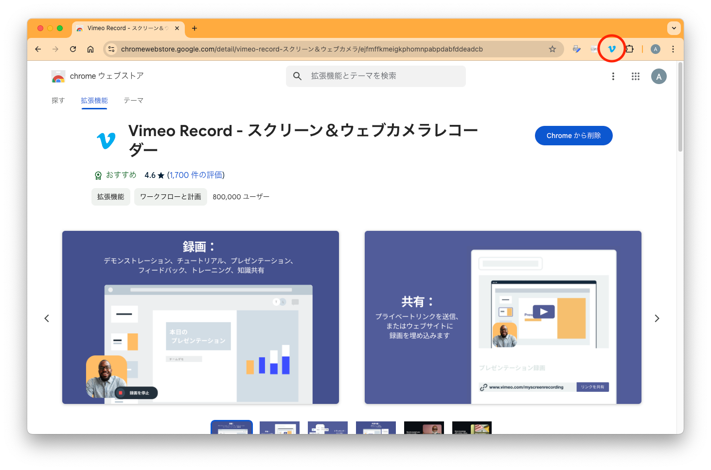
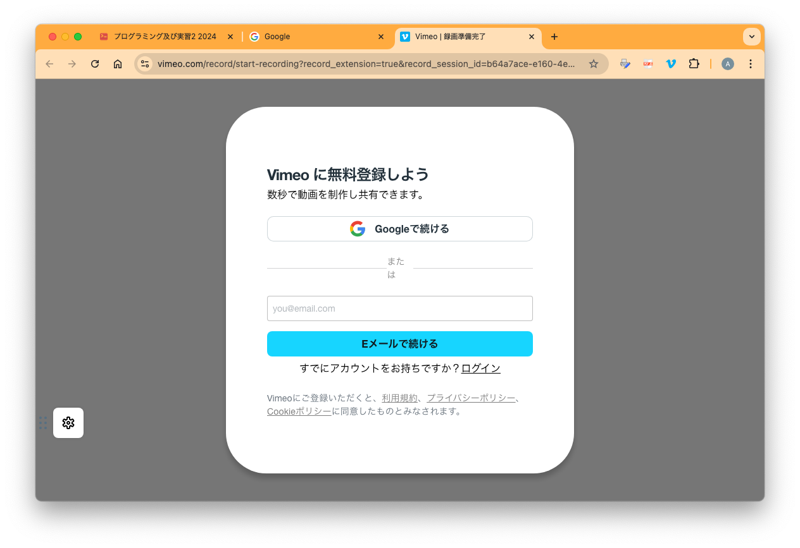
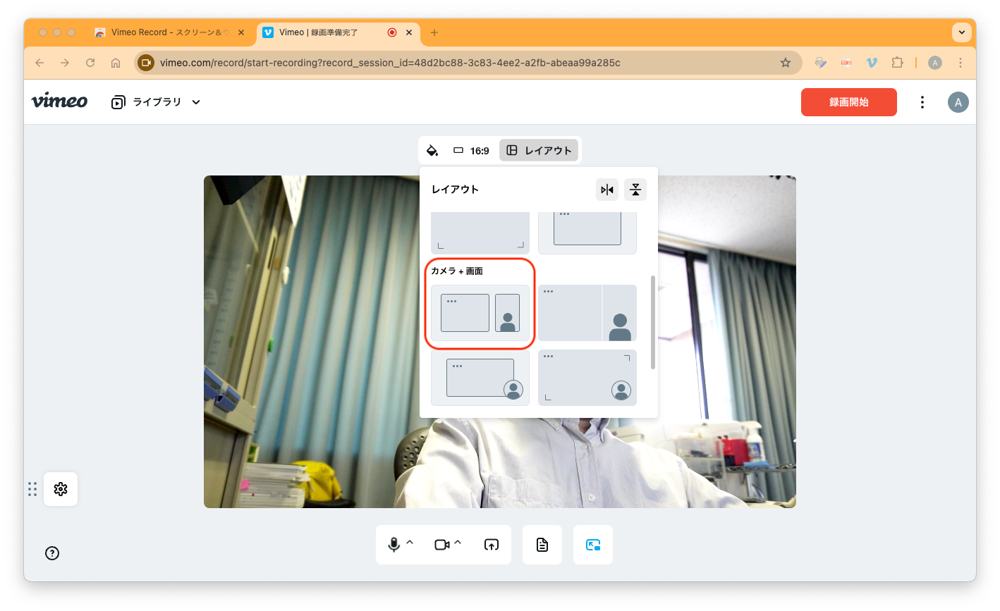
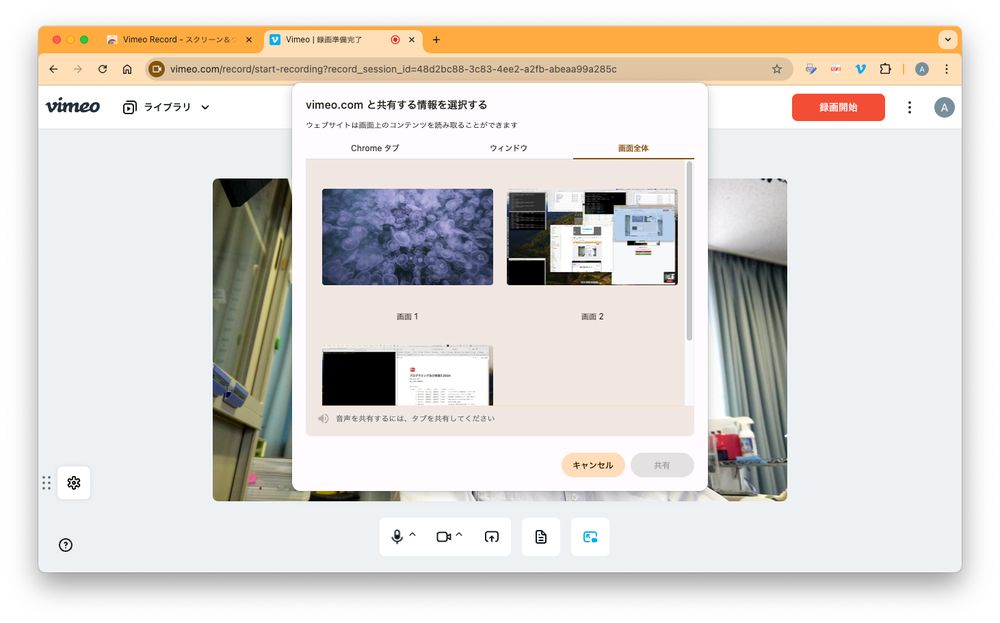
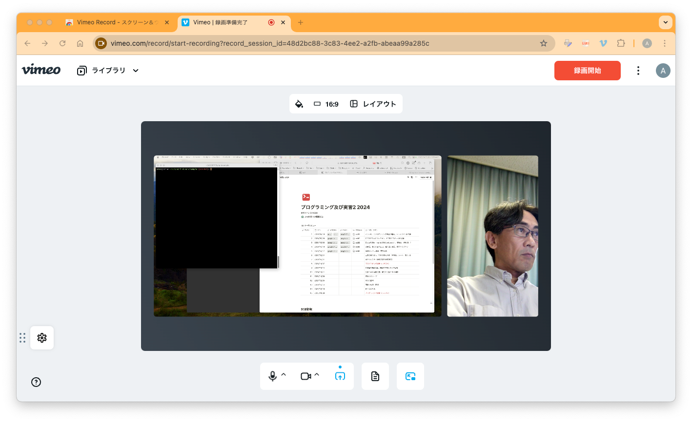
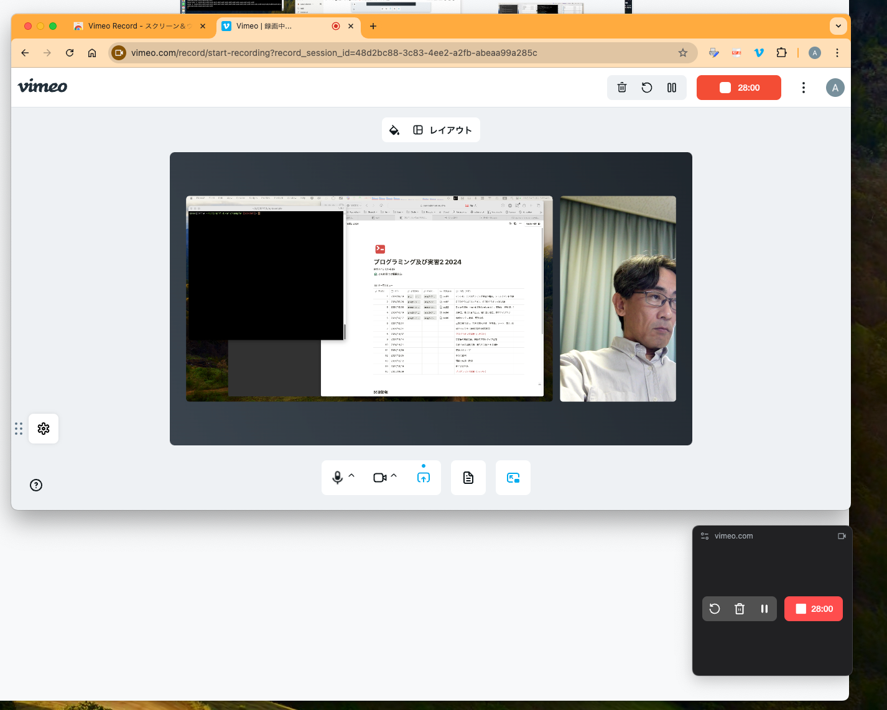
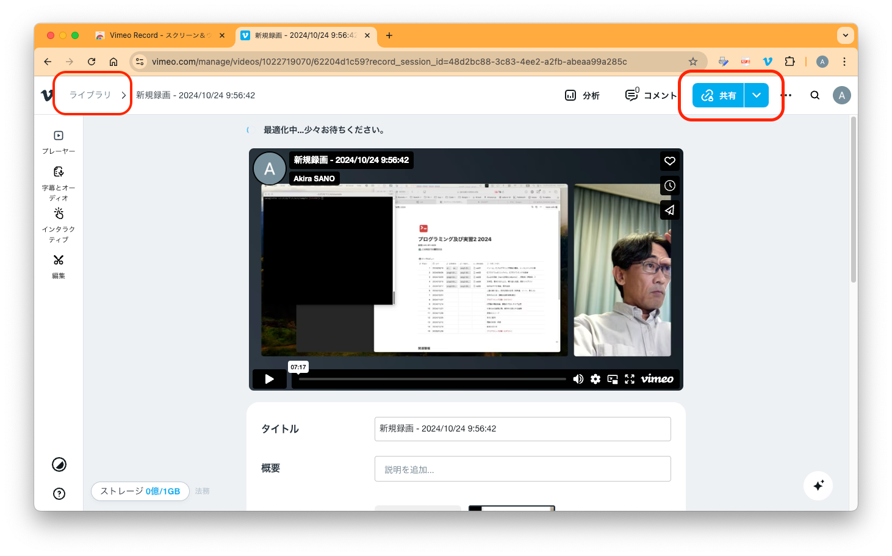

# Vimeo Record でのクラウドデスクトップ録画

[Vimeo Record](https://vimeo.com/jp/features/screen-recorder) 無料アカウントで最大30分のデスクトップ録画ができます。30分を超える録画を行う場合は、30分ごとに録画開始ボタンを押して複数の録画を作成する必要があります。

### **対応ブラウザ**

[Vimeo Record](https://vimeo.com/jp/features/screen-recorder)は、Chromium ベースのWebブラウザの拡張機能として動作します。 以下のいずれかのWebブラウザをインストールして下さい。

- [Google Chrome](https://www.google.com/intl/ja_jp/chrome/)
- [Microsoft Edge (Chromium版)](https://www.microsoft.com/ja-jp/edge)

Microsoft Edge には、レガシー版と最新の Chromium版があるので注意して下さい（[新Microsoft Edge登場、レガシー版とChromium版の見分け方は？](https://news.mynavi.jp/article/20200117-954759/)）。

### **Vimeo Record 拡張機能のインストール**

対応ブラウザから chrome ウェブストアにアクセスして、以下の拡張機能をインストールします。

- [Vimeo Record - スクリーン＆ウェブカメラレコーダー](https://chrome.google.com/webstore/detail/vimeo-record-screen-webca/ejfmffkmeigkphomnpabpdabfddeadcb)
    

1. 拡張機能がインストールされると、右上のアイコンから Vimeo Record を起動できます。
    

2. Vimeoにログインされていない場合はログイン画面が表示されます。Googleアカウントを選択し、@mail.ryukoku.ac.jp の全学認証アカウントでログインしてください。
    

3. 初回起動時には、拡張機能からマイクやカメラへのアクセス許可が求められますので、これらを「許可」します。
4. レイアウトで「カメラ＋画面」を選択し、録画するデスクトップ画面を選択し「共有」ボタンを押します。
    

    

### **デスクトップ録画の開始**

デスクトップ画面全体とカメラ画像が共有されていることを確認できたら、右上の「録画開始」ボタンを押すことで録画が始まります。

> `macOS では、録画開始時にセキュリティ確認画面が表示されることがあります。「システム環境設定」>「セキュリティとプライバシー」>「プライバシー」>「画面収録」から、利用しているWebブラウザからの画面収録を許可して下さい。`

録画が開始されると、録画ボタンが30分からのカウントダウンタイマーに変わり、デスクトップ右下の小さなコントロール画面もタイマー表示となります。。

Vimeo Record を実行しているWebブラウザのタブを削除すると、この録画が終了してしまいます。録画中はWebブラウザを起動し、タブを開いたままにしておいて下さい。

### **デスクトップ録画の終了と共有リンクの取得**

録画中を表すカウントダウンタイマーをクリックすると録画が停止します。録画停止後、動画のアップロードと最適化処理が始まります。録画ボタンの場所には、共有リンクを取得できるボタンが表示されます。ここから共有リンクや動画ファイルのダウンロードができます。

また、左上の「ライブラリ」を辿ると、すべての録画を確認することができます。複数の録画を行った場合はここからそれぞれの録画を参照して下さい。

