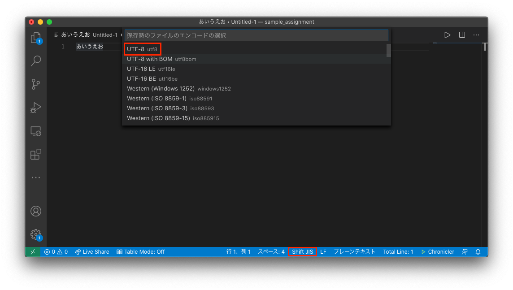

# Visual Studio Code と（日本語）文字コード

### UTF-8 文字コード

**Unicode**は、もっとも標準的に利用されている文字コード体系です。 このUnicodeの表現形式のうち、もっとも良く使われているものの一つが**UTF-8**です。 

Linux や macOS では、標準の文字コードとしてこの UTF-8 が利用されており、日本語を利用する際もあまり文字コードを意識することが少なくなりました。 しかし、Windows などでは、伝統的に日本語文字コードとして、**Shift JIS**と呼ばれる文字コードが利用されてきました。 このため、一般的に広く利用されるようになっている UTF-8 で書かれたファイルを（Shift JIS を文字コードとして利用している）Windows 上で扱う際に、この文字コードの差異によって**文字化け**（下記参照）が生じることがあります。

### ****Visual Studio Code での（日本語）文字コードの設定****

Visual Studio Code では、扱っているファイルの文字コードを自由に設定することができます。画面下部には現在編集中のファイルの文字コードが表示されています（以下では Shift JIS）。 この文字コード表示部分をクリックすると文字コードの選択画面が上部に表示されます。ここで新たに設定する文字コード（UTF-8）を選択して下さい。

WSLやmacOS上のCコンパイラ、Python3、Sharif-Judge などではソースファイルの文字コードとして UTF-8 を採用しています。 この科目で日本語を含むソースコードを書いたり、Sharif-Judge で提出する場合は、**必ず UTF-8 を用いてファイルを作成して下さい**。

#### ****文字コードと文字化け****

計算機では、すべてのデータ（画像データや音声データも！実数も！）を整数（正確には二進整数）で表現します。いま、みなさんが読んでいるこの日本語文字も計算機内部では整数として扱われています。 これらの文字（の見た目の形）と整数の対応付けが、**文字コード**と呼ばれているものです。

例えば、もっともよく利用されている英数字を表現するための**ASCIIコード**では、アルファベット大文字 **'A'** は、整数値 65 に対応付けられています。 逆にいうと計算機が数値65を、「整数値」として扱えば整数の65、「ASCII文字」として扱えば大文字 'A' として表現されることになります。

これらの「整数」と「文字の形」を対応付ける表（文字コード）はものすごく沢山の種類があります。また、それぞれの文字コードでは、同じ整数が表す文字の多くは異なったものとなります。 つまり、ASCIIコードに従って整数値 65 を文字表現すると 'A' ですが、別の文字コードで表現すると異なる文字としてディスプレイに表示されるかもしれません。

このように、ある整数として表現された文字を、そのデータ作成時に想定された文字コードとは別の文字コードで表示させようとすると、意図したものとは異なった文字列が表示されることになります。これを「文字化け」と呼びます。ちなみに日本語以外でも、こういった文字コード依存の表現のくずれを「Mojibake」と呼んでいます。ひらがなや漢字など、欧米と比較して多くの字形をもつ日本では、各研究機関やメーカーなどがそれぞれ独自に開発した複数の日本語文字コードを利用していました。そのため、日本では計算機の黎明期から「文字化け」がとくに頻繁に発生していたという経緯があります。
