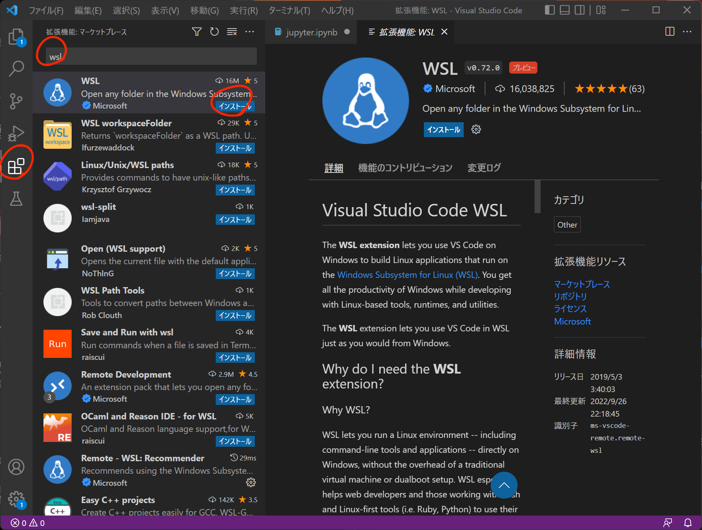
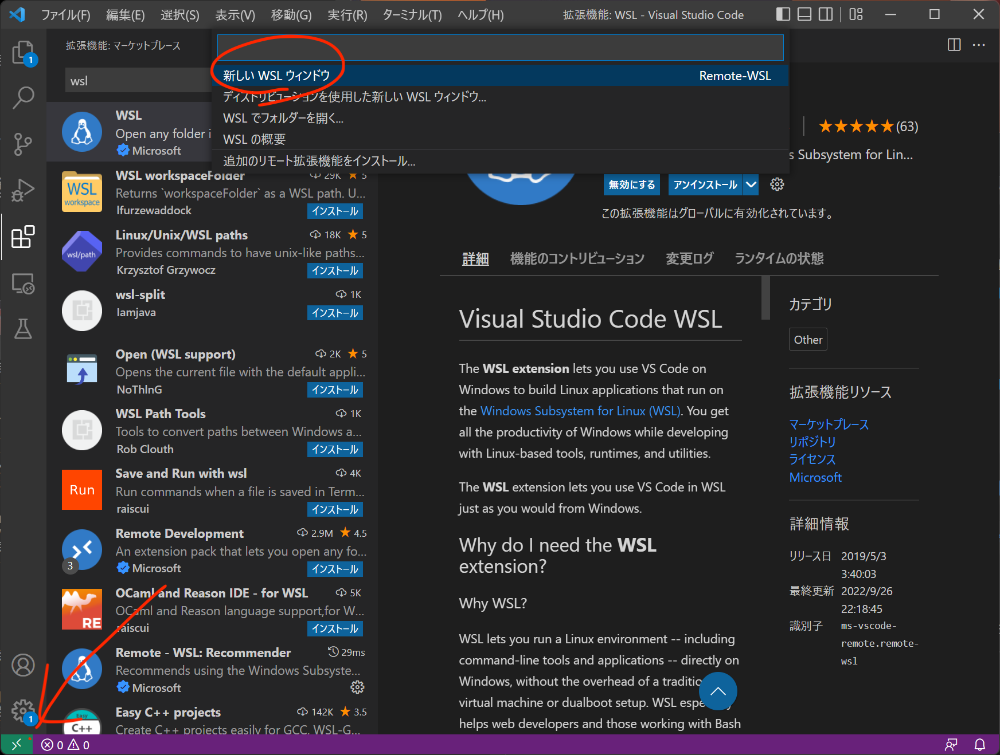
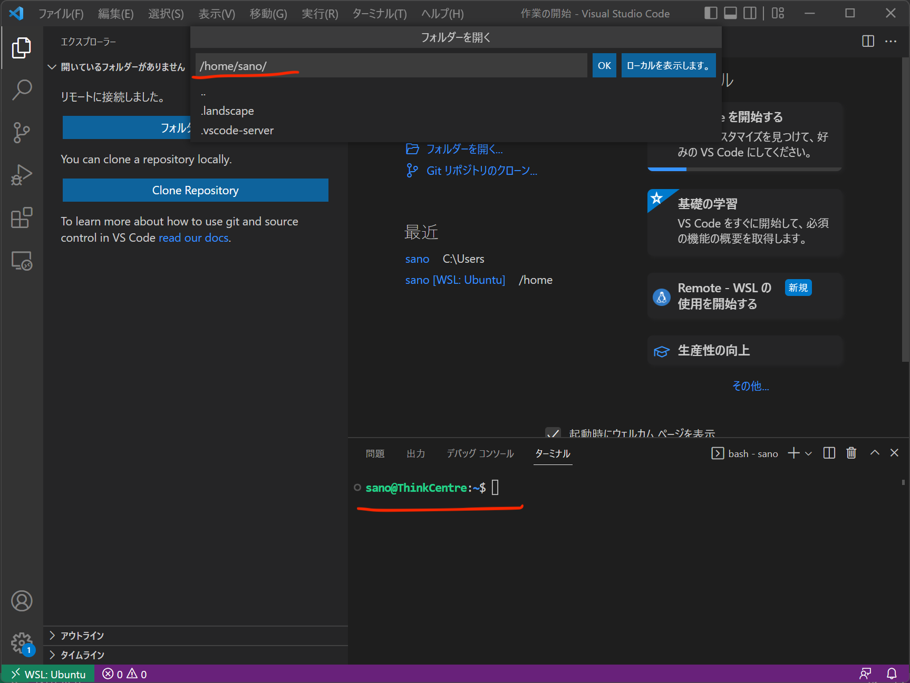

# WSL のための Visual Studio Code 設定

WSL を利用したプログラミング言語の実行環境は整ったでしょうか。実際のプログラミングでは、プログラムソースを記述するためのエディタが必要となります。 プログラミングに利用するエディタは好みに合うものを利用して構わないのですが、ここでは Microsoft の Visual Studio Code（VSCode）で WSL 環境を便利に使う方法を紹介します。

VSCode のインストール方法は、前期の[プログラミング及び実習I](http://www602.math.ryukoku.ac.jp/Prog1/index.html)を担当された中野先生のページ （[Windows](http://www602.math.ryukoku.ac.jp/Prog1/vscode-win.html) / [macOS](http://www602.math.ryukoku.ac.jp/Prog1/vscode-mac.html)）を確認してください。すでに日本語化（Japanse Language Pack のインストール）まで済んでいるものとします。

また、WSLと Ubuntu Linux のインストールを先に行ってください。

### ****WSL 拡張機能の追加****

WSL 拡張機能を利用すると、Windows 上にインストールされた VSCode から WSL 上のファイルを直接編集したり実行したりすることができるようになります。

左側メニューの「拡張機能」を選択し、WSL で検索します。検索リストから **WSL** を選択してインストールします。

WSL 拡張機能のインストールが成功すると VSCode の画面左下に緑色の >< （矢印？）ボックスが表示されるので、これをクリックします。 画面上部に現れるコマンド窓で「新しい WSL ウィンドウ」を選択します。

WSL への接続が成功すると、VSCode の新しいウィンドウが開きます。左下の緑色のボックスが接続先の **WSL: Ubuntu **などの表示に変わっていると思います。このウインドウ内の表示は、すべて接続先の WSL の内のものとなります。

右メニューの「エクスプローラ」や「フォルダーを開く」で表示されるファイルやディレクトリは、すべて WSL Ubuntu Linux 内部のものです。 また、上部メニューの「ターミナル」で表示される、コマンドラインインターフェイスも WSL 上で動いています。

#### 参考

- [WSL で VS Code の使用を開始する](https://docs.microsoft.com/ja-jp/windows/wsl/tutorials/wsl-vscode)
