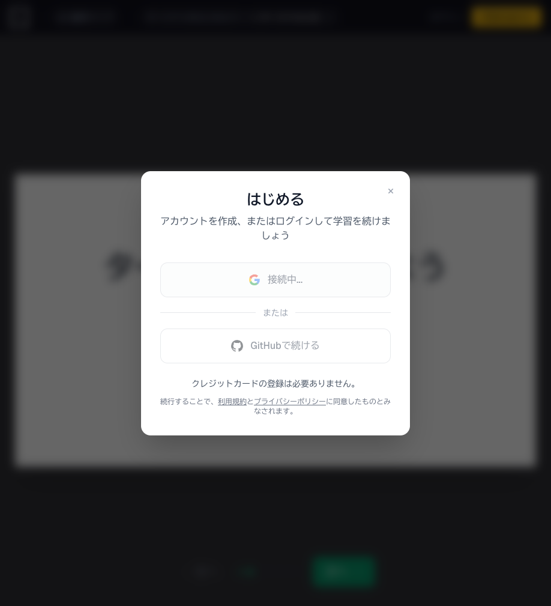
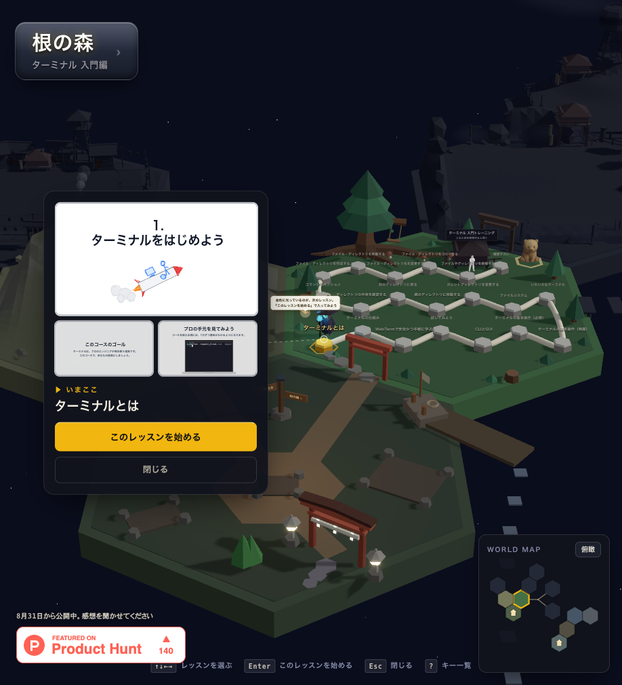
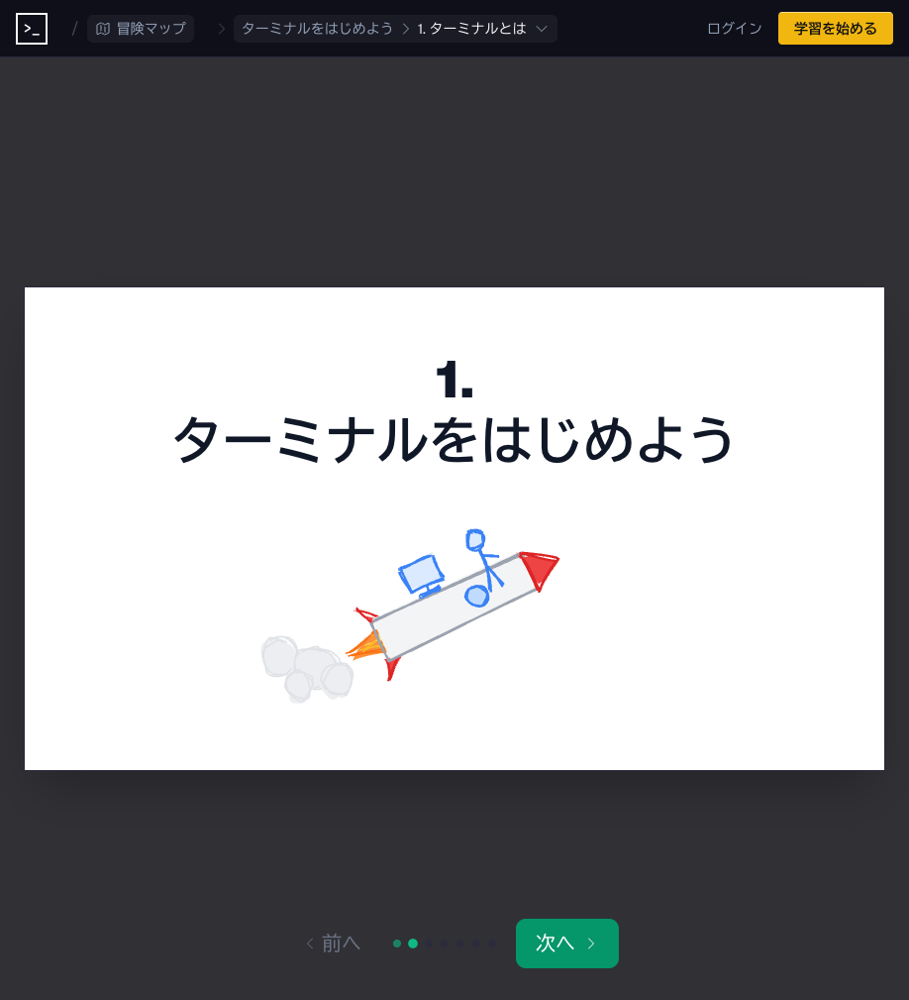
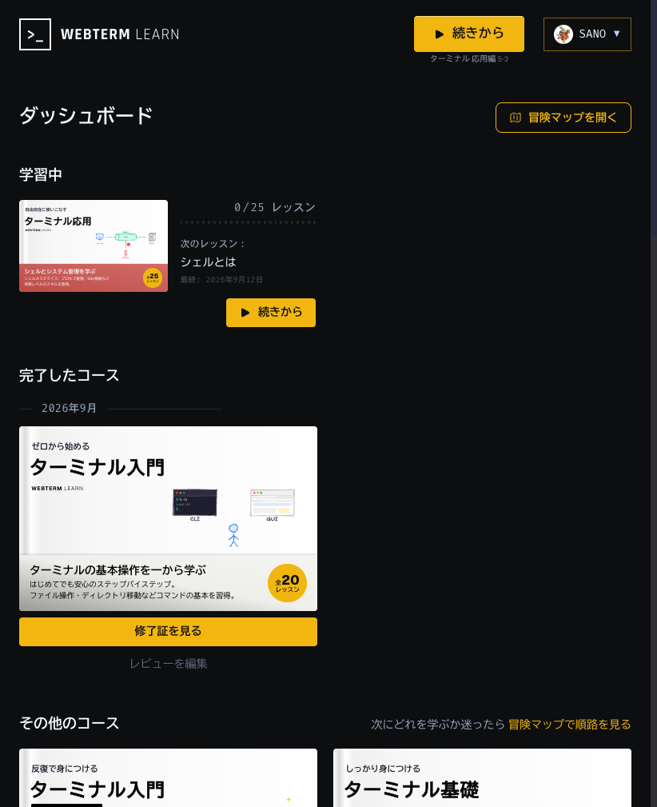

# WebTerm Learn でターミナル操作を練習する

[WebTerm Learn](https://learn.webterm.app/ja) は、ブラウザだけでターミナル（コマンドライン）操作を学べる無料の学習サイトです。
インストール不要で、ゲームのように「冒険マップ」を進みながらレッスンを進めます。

## Step 1: サインイン

トップページの **「学習を始める」** または **「冒険を始める」** から進むと、サインインを求められます。
**Google アカウント**（大学のメールアドレスでも可）または **GitHub アカウント**でサインインできます。
クレジットカードの登録は不要です。

!!! warning "修了証の名前について"
    修了証に表示される名前は、サインインに使った Google/GitHub アカウントの**本名**です。
    WebTerm 側の「アカウント設定」で変更できる「ユーザー名」は修了証には反映されません。
    学籍番号を修了証に載せることはできないので、**提出は aiJudge の自分のアカウントから行うことで本人確認とします**
    （別途スクリーンショット等での学籍番号提示は不要です）。

## Step 2: 「根の森 — ターミナル入門編」を選ぶ

サインイン後、3D の「冒険マップ」が表示されます。いくつかの土地（コース）がありますが、
この課題で取り組むのは **「根の森」＝「ターミナル 入門編」** です。

「根の森」を選ぶと、レッスンが一本道のマップになって並んでいます。「1. ターミナルをはじめよう」から順番に進めてください。

## Step 3: スライドと演習でレッスンを進める

各レッスンは「スライドで説明を読む → 実際にブラウザ内のターミナルで操作してみる」という流れです。
指示通りにコマンドを打って進めていってください。

## Step 4: 修了証を取得して提出する

「根の森（ターミナル入門編、全 20 レッスン）」をすべて終えると、右上のメニューから
**「ダッシュボード」** を開いた際に「完了したコース」として表示され、**「修了証を見る」** から
修了証（Certificate of Completion）を確認できます。

修了証が表示されたら、**「PNG をダウンロード」** で画像として保存してください。

- ダウンロードした **修了証の PNG 画像を aiJudge の該当する課題に提出**してください。
- aiJudge では画像は自動採点ではなく、**教員・TA が確認して採点**します。
