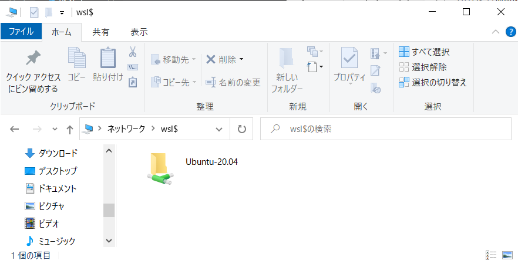
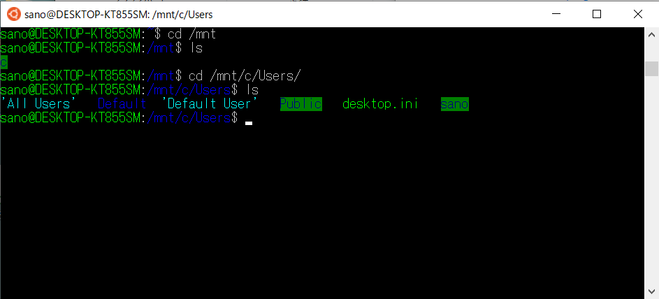

# WSLとWindows とのファイル共有

WSL上の Ubuntu Linux は Windows 上で動いているように見えますが、実際にはそれぞれが独立した別々のシステムとして動作しています。したがって、お互いのファイルなども独立した別システムとして動いており、一方のOS（Windows）から直接他のOS（Ubuntu Linux）のファイルを読み書きすることができません。

しかし、それではいろいろと不便なので、WSL には Windows と双方のファイルを共有するための仕組みが用意されています。

### ****Windows のファイルエクスプローラから WSLで動作する Ubuntu Linux のファイルにアクセスする****

エクスプローラーのアドレス欄に **\\wsl$** と入力すると（右側の検索欄ではないので注意：下画像を参照、環境によっては \（バックスラッシュ） を ¥（半角円マーク）に読み替えて下さい）、起動中の WSL でインストール済みのOSの一覧が表示され、それぞれのファイルにアクセスできるようになります。 WSLでインストールされた Ubuntu Linux の各ユーザーディレクトリは、**/home** の下にあります。

### ****WSL の Ubuntu Linux から Windows のファイルにアクセスする****

WSL 上のUbuntu Liux からは、**/mnt** 配下に Windows の各ディスクシステムが見えます。 Windows の Cドライブは、**/mnt/c** となります。 Windows の各ユーザーのフォルダは（一般的には）**/mnt/c/Users** の下にあります。

### 参考

その他、Windows から Linux 上の実行ファイルを直接呼び出して動作させる方法などがあります。詳しくは以下の公式ドキュメントを読んでください。

- [Windows および Linux ファイル システム間での作業](https://docs.microsoft.com/ja-jp/windows/wsl/filesystems)
