# Windows への WSL の導入と日本語化

Windows Subsystem for Linux（WSL） は、Windows上で Linux を動作させるための Windows 標準機能です。

!!! note

    WSL には古いバージョンの WSL1 と、ここで紹介する WSL2 があります。WSL1 と WSL2 は、一つのWindows 上で共存することが可能です。2023年現在の時点では、新しいWSL2が安定して動くようになっています。この科目ではWSL2の利用を前提とします。WSL = WSL2 と読んで下さい。

WSL のインストール方法は、Microsoft の公式ドキュメント「[**WSL を使用して Windows に Linux をインストールする**](https://docs.microsoft.com/ja-jp/windows/wsl/install)」に詳しく記載されています。先端理工学部の学生は、自分で学修や研究に必要なPC環境を構築・整備できるようになることが期待されています。上記のような公式ドキュメントや、ネット上で検索できる情報をもとに WSL 環境を自力で構築してみることをお勧めします。最近であれば ChatGPT などに尋ねながら自力構築しても良いですね。

とは言うものの、WSL 環境が構築できないと多くの情報系科目での学修が滞ってしまうので、このページではWSL 導入のポイントを整理しておきたいと思います。

---

---

### WSL **導入前の確認**

WSL はWindows の標準機能として提供されていますが、WSL を利用するためには以下の条件を満たす必要があります。WSL のインストール前に、利用している Windows のバージョンを確認してください。

> Windows 10 バージョン 2004 以降 (ビルド 19041 以降) または Windows 11 を実行している必要があります。

ここ数年以内に購入したPCであれば、間違いなくこの条件を満たしていると思います。もしこの条件を満たしていない場合は、**Windows Update を実行し Windows を最新のバージョンにアップデートしてください。**

#### Windows バージョンの確認方法

Windows のバージョンを確認して、WSLの導入条件を満たしていることを確認します。

[お持ちの Windows のバージョンを確認する](https://support.microsoft.com/ja-jp/windows/お持ちの-windows-のバージョンを確認する-12d35019-4da9-0cb1-ba47-f8b031b712ad)

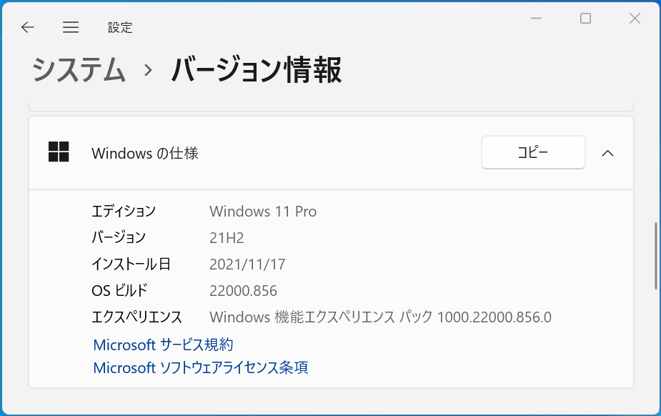

### **WSL と Ubuntu Linux の導入**

Windows に WSL（Windows Subsystem for Linux、以下 WSL）を導入します。同じ内容が「[**WSL を使用して Windows に Linux をインストールする**](https://docs.microsoft.com/ja-jp/windows/wsl/install)」にあります。

1. Windows の検索から「powershell」と入力して「管理者として実行」より、Windows PowerShell を管理者権限で起動してください。
2. 管理者権限で起動した PowerShell で以下を入力します。
    ```powershell
    wsl --install
    ```

3. WSL のインストールが始まります（少し時間が掛かります）。**インストールが完了したらPCを再起動してください。**
    - すでに WSL がインストール済みの場合は、wsl コマンドの使用方法が表示されます。

    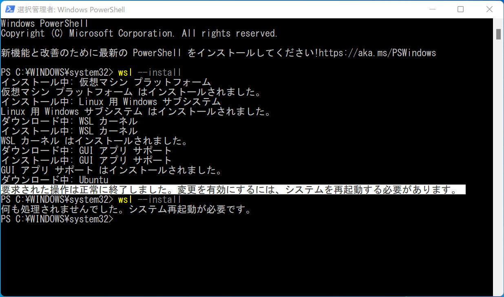

4. PC を再起動しログインすると、以下のような Ubuntu Linux の初期設定画面が表示されます。
    - この画面が表示されない場合はWindowsの検索窓から「ubuntu」で検索して、Ubuntu Linux を起動します。

    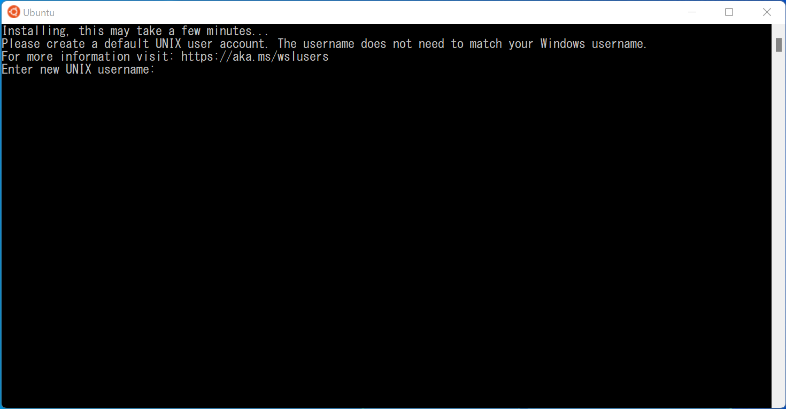

5. Ubuntu Linux のユーザー名とパスワードを決めて入力します。
    - ユーザー名は必ず半角英数のみを利用しましょう。日本語などを使うと後でトラブります。
    - パスワードはキーボード入力しても表示されません。
    - パスワードは2回入力します。2回の入力が一致すればパスワードとして登録されます。
        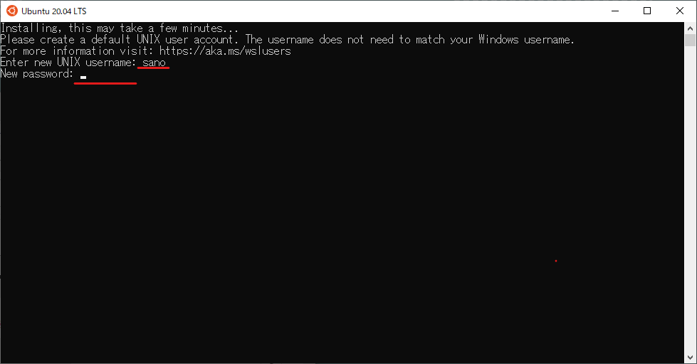

    - ユーザー登録が成功すると、そのユーザーで Ubuntu Linux にログインします。
        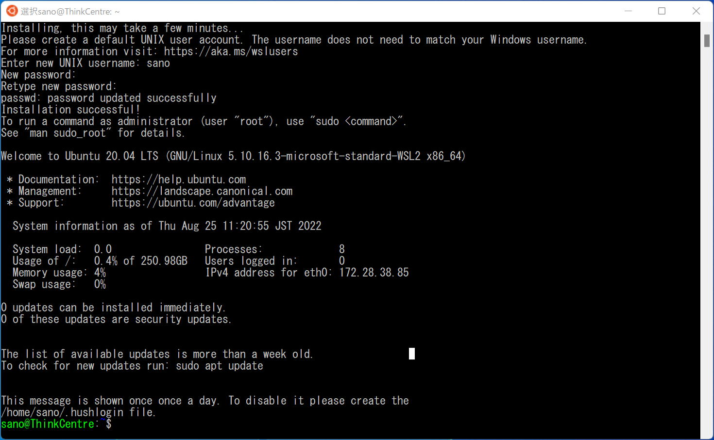

6. 次回以降は、Ubuntu Linux を起動すると登録したユーザーとして自動ログインされます。
    - このユーザーは管理者ユーザーとなり、登録したパスワードは管理コマンドを実行するときに必要となります。

    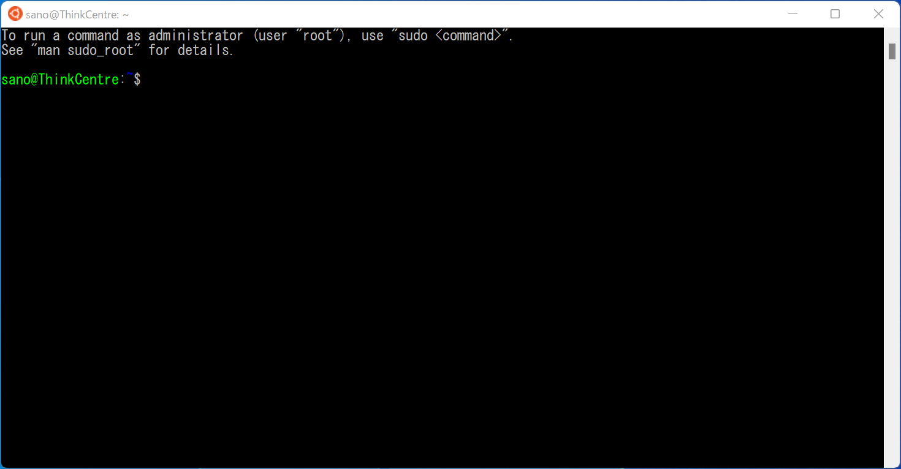

#### Ubuntu Linux の削除と再インストール

ユーザー登録に失敗したり、Ubuntu Linux がうまく起動しなくなった場合は、以下の手順で Ubuntu Linux を再インストールすることができます。ただし、自分で書いたプログラムソースなどの Ubuntu Linux 内のファイルは消去されます。必要に応じて、消去前に Windows 上にファイルをコピーするなど対処してください。

1. PowerShell から Ubuntu Linux を削除する。

```powershell
wsl --unregister Ubuntu
```

2. Ubuntu Linux をインストールする。

```powershell
wsl --install -d Ubuntu
```

3. インストールが成功すると Ubuntu Linux が自動で起動し、ユーザー名とパスワードの初期登録画面が表示されます。

### Ubuntu ソフトウェアパッケージの更新

1. Ubuntu に導入済みのアプリケーションパッケージの情報を最新のものにアップデートします。Ubuntu に以下のコマンドを入力します。
    ```powershell
    sudo apt update
    ```

    パッケージ管理の aptコマンドで、updateを実行します。ただし、sudoを前に付けて管理者権限で実行し ます。 sudo での実行は初回に決めたパスワードの入力が必要です。

    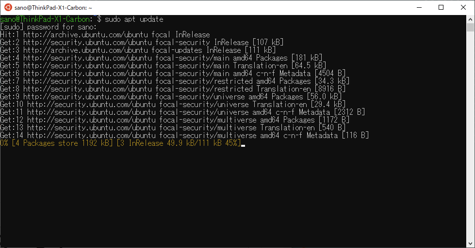

2. 以下を入力すると、更新した情報に基づいて Ubuntu Linux のパッケージを最新版にアップグレードします。途中、y/n での確認のキー入力が必要です。
    ```powershell
    sudo apt upgrade
    ```

### Ubuntu Linux の日本語化

#### 日本語パッケージのインストール

1. 日本語言語パッケージをインストールします（apt コマンドに -y を付けると y/n の途中確認が省略できます）。
    ```powershell
    sudo apt -y install language-pack-ja
    ```

    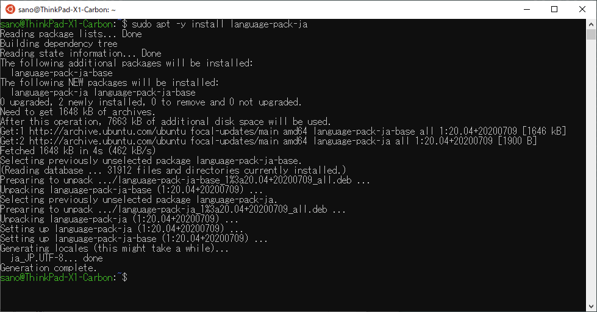

2. 言語設定を日本語に変更します。設定後、Ubuntu のターミナル（コマンド入力している窓です。コマンドベースのインターフェイスをこう呼びます。）を一旦閉じて Ubuntu Linux を立ち上げ直します。
    ```powershell
    sudo update-locale LANG=ja_JP.utf8
    ```

    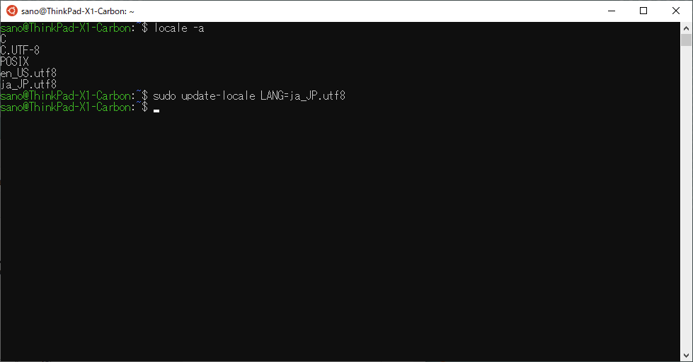

3. 言語設定が日本語になっていることを確認。日時を表示して日本語表記になっていればOK。
    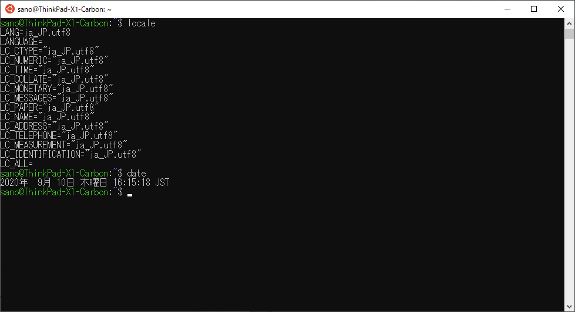

### 日本語マニュアルのインストール

```powershell
sudo apt -y install manpages-ja manpages-ja-dev
```

マニュアルを表示する man コマンド

```powershell
man ls
```

の英語表記が、

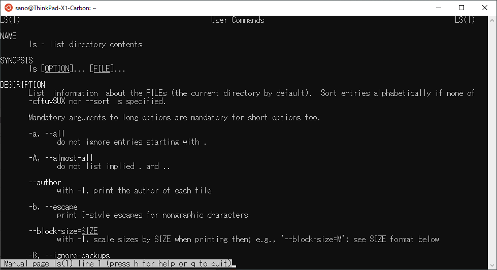

インストール後は日本語になる。

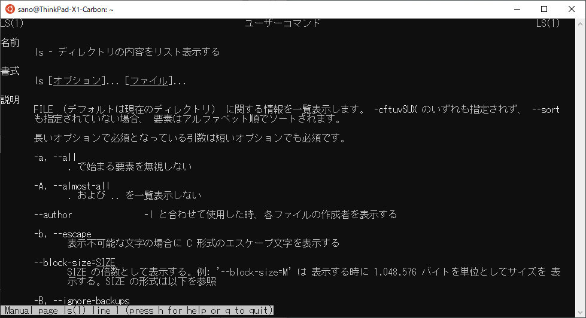
